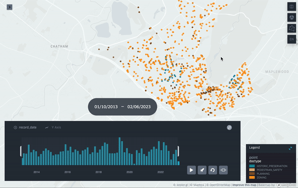
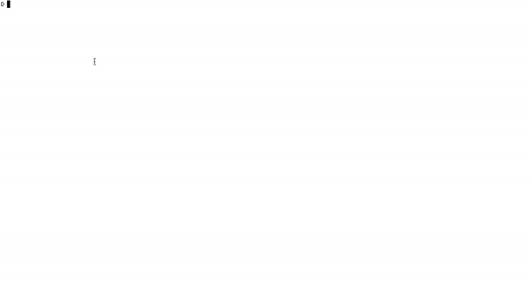

# muni-minutes-map
Automatically generate a map of zoning and planning decisions from municipal minutes pdfs. OpenAI GPT is used to extract addresses, summaries, resolution status, and tags.

## Demos

- Play with interactive map here: [Interactive Map](https://jasonlaska.github.io/muni-minutes-map/kepler.gl.html)

- Easily build a [kepler.gl](https://kepler.gl/demo) map ([demo/sql/to_kepler_table.sql](demo/sql/to_kepler_table.sql)):

- Query a property history by address ([demo/find_address_summaries.sql](demo/sql/find_address_summaries.sql)).

## Installation

- In your python env:

    `pip install -r requirements.txt`

- Install tesseract dependency
    - `brew install tesseract` (mac)
    - set `POPPLER_PATH` to your poppler path in [components/processors/pdf2text.py](https://github.com/jasonlaska/muni-minutes-map/blob/feature/readmegif/components/processors/pdf2text.py#L9)

- Install duckdb cli

    `brew install duckdb` (mac)

- Install a local copy of chromium driver
[https://chromedriver.chromium.org/getting-started](https://chromedriver.chromium.org/getting-started)

- Set your openai key as `OPENAI_KEY` envvar:

    `export OPENAI_KEY=<your key>`

## About

Weekend project to play with

- GPT for structuring unstructured local municipal data
- duckdb
- selenium

There are no tests, this code is provided as is!

If you would like to help write munisource crawlers for other cities, reach out.